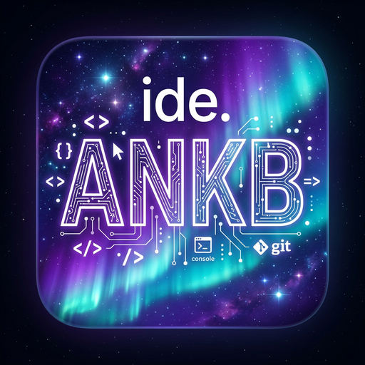

# ide.ankb Desktop App — C# WPF (.exe)

Branch `app` — bản desktop cho Windows, **chỉ dùng Judge0 CE**, không còn Wandbox/Piston. C++ versions sắp xếp giảm dần 23→11, hiển thị lỗi chi tiết.



## Features (so với bản web v9.5)

- **Judge0 CE mặc định** — không còn Wandbox (đã bỏ theo yêu cầu)
  - Default endpoint: `https://ce.judge0.com` (public, có thể 401 nếu quá tải)
  - Tự host: `docker run -d -p 2358:2358 judge0/judge0:1.13.1` → set env `JUDGE0_API_URL=http://localhost:2358`
  - RapidAPI: `https://judge0-ce.p.rapidapi.com` → set `JUDGE0_API_KEY` + `JUDGE0_API_HOST`
- **C++ versions giảm dần**: C++23 (selected), C++20, C++17, C++14, C++11 — đúng yêu cầu
- **Hiển thị lỗi chi tiết**: Compile error, runtime error, stderr, stdout, exit code, time, memory, backend URL luôn hiện
  - Nếu sai code → hiện luôn `❌ Compile Error` + dòng lỗi `main.cpp:12` + clickable jump to line
  - Nếu OCI `crun: clone` → hiện `⚠️ Container overloaded` + nút retry Judge0
- **Desktop .exe**:
  - WPF .NET 8.0-windows, dark theme giống web, logo ide.ankb
  - Sidebar 📁🔍🌿▶️🧩 với Open/Save
  - Topbar: brand, C++ version selector, connection badge 🟢 Online (Judge0), Open/Save, Run
  - Editor: `TextBox` monospace Consolas, AcceptsTab, auto save? (có thể thêm AvalonEdit sau)
  - Input (stdin) + Output tách riêng, resizable via GridSplitter
  - Status bar: Ln Col, UTF-8, Spaces, Mode, Time
  - Auto Save local? Chưa, nhưng có thể thêm
  - Ctrl+A/C/V/X/Z/Y được phép (giống web đã fix security.js)

## Build .exe

### Yêu cầu
- Windows 10/11
- .NET 8 SDK (tải từ https://dotnet.microsoft.com/download)
- Visual Studio 2022 hoặc `dotnet` CLI

### Build

```bash
cd app

# Debug build
dotnet build

# Release .exe single file self-contained (không cần .NET runtime trên máy khác)
dotnet publish -c Release -r win-x64 --self-contained true -p:PublishSingleFile=true -p:IncludeNativeLibrariesForSelfExtract=true -o publish

# Kết quả: app/publish/IdeAnkb.exe (khoảng 60-150 MB self-contained)
```

### Chạy

```bash
# Set Judge0 endpoint nếu tự host
set JUDGE0_API_URL=http://localhost:2358
# Hoặc RapidAPI
set JUDGE0_API_URL=https://judge0-ce.p.rapidapi.com
set JUDGE0_API_KEY=your-rapidapi-key
set JUDGE0_API_HOST=judge0-ce.p.rapidapi.com

# Chạy
.\publish\IdeAnkb.exe
```

Hoặc mở `IdeAnkb.sln` trong Visual Studio → F5.

## Cấu trúc

```
app/
├── IdeAnkb.csproj          # .NET 8 WPF, WinExe, logo.png as icon
├── App.xaml / App.xaml.cs
├── MainWindow.xaml         # UI: sidebar, topbar, editor, input, output, statusbar
├── MainWindow.xaml.cs      # Logic: RunWithJudge0, Open/Save file, error display detailed
└── README.md
```

## So sánh với bản web

| Tính năng | Web (main) | Desktop app (branch app) |
|-----------|------------|--------------------------|
| Compiler | Backend proxy → Judge0 → Piston → Wandbox | Judge0 CE only (no Wandbox) |
| C++ versions | 17,20,23,14,11 (mixed) | 23,20,17,14,11 descending (user request) |
| Error display | Friendly UI + guide | Detailed always: compile_error, stderr, stdout, exit code, backend URL |
| File ops | Download/Open via browser | OpenFileDialog / SaveFileDialog native |
| Theme | Dark+ + GitHub Dark etc | Dark theme WPF |
| Executable | N/A (web) | .exe via dotnet publish |

## Sửa lỗi hiển thị chi tiết (theo yêu cầu)

Trước: chỉ hiện `⛔ Compilation failed` + `Error: OCI runtime error...`

Giờ:
```
❌ Compile Error (C++23 via judge0)
━━━━━━━━━━━━━━━━━━━━━━━━━━━━━━
Compiler: C++23 (lang 54) - Compilation Error
Exit: 6
━━━━━━━━━━━━━━━━━━━━━━━━━━━━━━
main.cpp:12:5: error: expected ';' before 'cout'
   12 |    cout << "Hello world!"
      |    ^~~~
...
💡 Fix: Check line numbers above...
```

```
💥 Runtime Error (Mode: judge0)
━━━━━━━━━━━━━━━━━━━━━━━━━━━━━━
Backend: https://ce.judge0.com
Stage: run
Exit: 11
━━━━━━━━━━━━━━━━━━━━━━━━━━━━━━
Stderr: Segmentation fault
Stdout: 
...
```

## License

Same as main repo MIT.

## Logo

Logo từ `public/logo.png` (aurora ANKB) — favicon web cũng là logo luôn.
